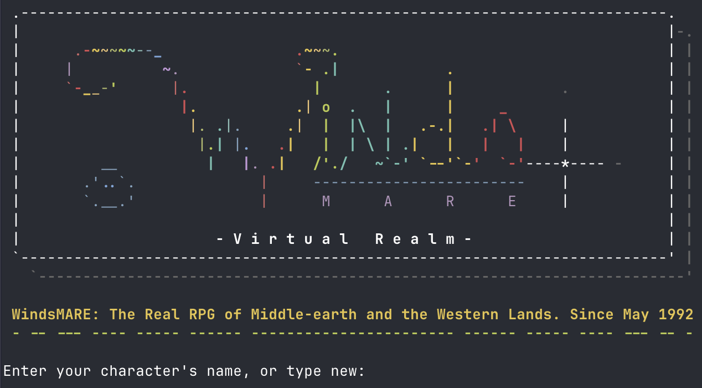

# TinyMARE on macOS and Linux

[](https://github.com/ncmud/TinyMARE/actions/workflows/cmake.yml)
[](https://github.com/ncmud/TinyMARE/actions/workflows/zig.yml)

TinyMARE is Byron Stanoszek's (Gandalf's) code from WindsMARE. We host this
repository for archival purposes, preserving his work and making it easier for
people to jump in, build the server, and explore the game on modern systems.
The original code belongs to its authors; our additions provide build tooling,
portability fixes, and instructions for getting started.

This archive is based on TinyMARE 1.0.10340. The original releases are available
in the [WindsMARE TinyMARE release archive](https://www.winds.org/pub/tinymare/).
See [LICENSE](LICENSE) for the original copyright notice and terms.



Both CMake and Zig compile the existing C game. Neither requires converting it
to another language. Builds generate their own configuration header and leave
`src/hdrs/main.h` and the source version unchanged.

## CMake

Requires CMake 3.18+ and GCC or Clang. On macOS, install the Xcode Command Line
Tools; on Linux, install your distribution's C compiler, CMake, and libc headers.

```sh
cmake -S . -B build -DCMAKE_BUILD_TYPE=Release
cmake --build build -j
cmake --build build --target run
```

The executable is `build/netmare`. To use a different port for one launch:

```sh
./tools/run build/netmare 7349
```

Optional defaults are `-DMARE_NAME=MyMARE`, `-DMARE_PORT=7348`, and
`-DMARE_EMAIL=admin@example.com`, passed to the first command.

## Zig

Tested with Zig 0.15.2. Zig supplies the C compiler and build runner.

```sh
zig build -Doptimize=ReleaseFast
zig build run -Doptimize=ReleaseFast
```

The executable is `zig-out/bin/netmare`. Optional defaults are `-Dname=MyMARE`,
`-Dport=7348`, and `-Demail=admin@example.com`. Pass a launch port after `--`:

```sh
zig build run -Doptimize=ReleaseFast -- 7349
```

On this Mac, Zig 0.15.2 cannot link its build runner against the Xcode 27 SDK's
ARM library stubs. The installed Command Line Tools SDK works. Prefix Zig
commands with this environment setting (no global Xcode change is needed):

```sh
DEVELOPER_DIR=/Library/Developer/CommandLineTools zig build -Doptimize=ReleaseFast
DEVELOPER_DIR=/Library/Developer/CommandLineTools zig build run -Doptimize=ReleaseFast
```

Zig can also build a Linux executable from this Mac:

```sh
DEVELOPER_DIR=/Library/Developer/CommandLineTools zig build \
  -Dtarget=x86_64-linux-musl -Doptimize=ReleaseFast --prefix zig-out-linux
```

The resulting `zig-out-linux/bin/netmare` runs on x86-64 Linux; copy the `run`
assets along with it. The Zig stack setting defaults to downward growth, as on
the tested ARM64 and x86-64 platforms; an unusual upward-growing target can use
`-Dstack-grows-down=false`. CMake probes the native stack direction.

## Running and stopping

Run steps create `run/db` and `run/logs`, then start the server on TCP port 7348
by default. The server detaches into the background. Logs are in `run/logs/main`
and `run/logs/io`; game data is in `run/db/mdb`. Ctrl-C in the launching terminal
does not stop a detached server.

Connect with `telnet localhost 7348` or a MUD client using host `localhost` and
port `7348`. Type `New` to create a character. The first character becomes the
administrator and must be created from localhost. The bundled welcome text still
uses the original WindsMARE branding; the default game name is TinyMARE.

Use `@dump` in the game to save, and `@shutdown` as administrator to save and
stop. If no administrator exists yet, find the listener with
`lsof -nP -iTCP:7348 -sTCP:LISTEN` and send `kill -TERM <PID>` for a graceful stop.
Stop the existing server before launching another build on the same port.

## Example world

A fresh TinyMARE database contains only Limbo and your first character. For a
small populated example, Eric Angell's
[MareMac demo database](https://github.com/erangell/kfest2024/blob/main/MareMac/run/db/mdb)
provides an educational Azure world with 10 rooms, 18 exits, 22 things, and one
existing player. It demonstrates rooms and informational objects rather than
combat or quests. This database has been test-loaded with this release.

Download a pinned copy into its own runtime directory, separate from your main
game. The example directory, downloaded database, and local saves are ignored
by Git. Run these commands from the repository root after building:

```sh
mkdir -p examples/azure-demo/db examples/azure-demo/logs examples/azure-demo/mail
cp -R run/msgs run/help run/etc run/maps examples/azure-demo/
curl --fail --location \
  https://raw.githubusercontent.com/erangell/kfest2024/ba77ec2fb88e29f01d71256f2f34be5a29ad31a2/MareMac/run/db/mdb \
  --output examples/azure-demo/db/mdb
(cd examples/azure-demo && ../../build/netmare 7349)
```

For Zig, substitute `../../zig-out/bin/netmare` in the last command. Connect to
`localhost:7349` and type `New` to create your own character. The database already
has an administrator, so your new character will be a regular player. The
download does not provide that administrator's login credentials.

The server runs in the background. To stop this example, use
`lsof -nP -iTCP:7349 -sTCP:LISTEN` to find its PID, then `kill -TERM <PID>` to
save and stop it. Downloading the database again overwrites your example saves.

For an online world to explore, the
[MicroMARE connection instructions](https://github.com/erangell/kfest2024/blob/main/readme.md)
list `mare.hoardersheaven.net:4201` with guest access. That is a separate hosted
world; the Azure download above is the locally runnable example.

## Verification and comparison

GitHub Actions builds and tests CMake and Zig on Linux and macOS for each pull
request and push to `trunk`. Zig runs in both Debug and ReleaseFast modes; its
Linux release job also builds and tests a static x86-64 Linux executable. Actions
are pinned to release commits, with weekly Dependabot checks for updates.

Python 3 is needed only for the smoke test. It starts a real server with a
temporary database and checks character creation, login, expressions, object
creation, save/reload, and clean shutdown. It does not alter the real game.

```sh
ctest --test-dir build --output-on-failure
DEVELOPER_DIR=/Library/Developer/CommandLineTools zig build test -Doptimize=ReleaseFast
```

On Linux, omit `DEVELOPER_DIR`. Either binary can also be tested directly:
`python3 tests/smoke.py path/to/netmare`.

| Consideration | CMake | Zig |
| --- | --- | --- |
| Build interface | Configure, then build | One build command |
| Toolchain | Uses installed GCC/Clang | Includes its C compiler |
| This Mac | Works with default Xcode setup | 0.15.2 needs the SDK setting above |
| Linux | Native GCC build tested on Alpine | Native build tested on Alpine |
| Cross compilation | Requires a target toolchain/sysroot | Mac-to-x86-64 Linux musl build tested |
| Runtime verification | Passed on macOS and ARM64 Linux | Passed on macOS, ARM64 Linux, and cross-built x86-64 Linux |

CMake is the lower-friction choice on this machine today. Zig offers the shorter
interface and an already verified Linux cross-build. Both are available so the
choice can remain open. Zig's [build-system documentation](https://ziglang.org/learn/build-system/)
describes its compiler, target, and build options.

The original interactive `src/configure` and Makefiles remain available; see
`INSTALL` for that workflow.
